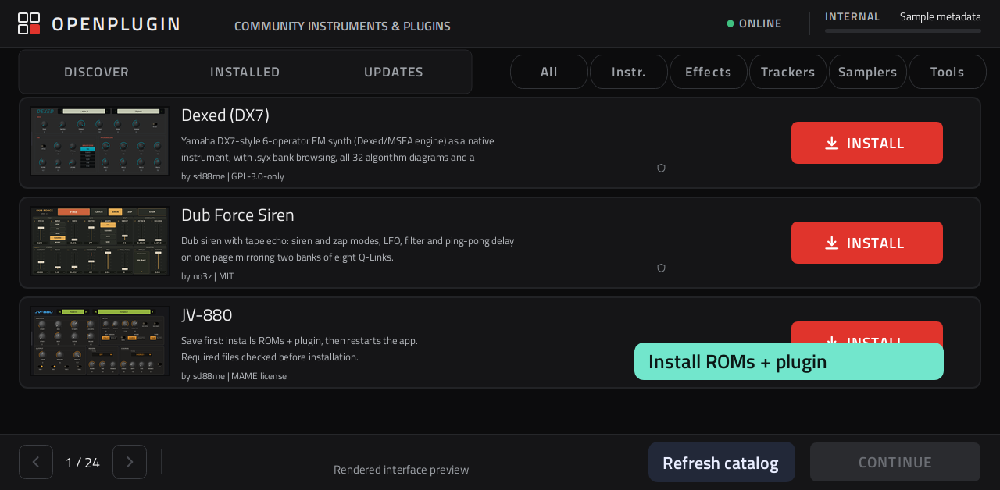

# OpenPlugin Research

An experimental community instrument and plugin browser for **Akai Force and
MPC Gen1**, developed with AI. Independent, non-commercial and unaffiliated
with Akai or inMusic.

[Browse plugins](https://magicstino.github.io/force-openplugin/#catalog) ·
[Download IMG candidates](docs/DOWNLOADS.md) · [Find or publish a plugin](docs/DISCOVERY.md) ·
[Package format](docs/SOURCES.md) · [Validation](docs/TESTING.md)

**Hardware status:** the owner reports successful Force use and ROM download.
MPC Gen1 and the new combined setup remain unverified on hardware. Research candidates.



## What it does

- Browse community instruments, effects, samplers, trackers and tools.
- Show plugin previews, descriptions, authors, licenses and package versions.
- Filter the catalog or add a compatible GitHub release through FIND.
- Queue installation, updates and removal in the native manager.
- Refresh the online catalog and website cards on a six-hour schedule.
- Tap **Refresh catalog** on the device to fetch available plugins and versions; it does not install updates.
- JV setup offers **Install ROMs + plugin**. Save first: completion restarts the app.

For existing 3.9.1 users: the updater can ask to reinstall the **same version, 3.9.1**.
The OpenPlugin build number labels our additions; the stock internal version remains unchanged.
See [catalog refresh](docs/CATALOG-REFRESH.md).

The current index has 71 entries and 57 bundled native previews. Unknown images
use placeholders. New source packages require review; inclusion is not a
hardware compatibility guarantee. See [image sources and limits](docs/ILLUSTRATED-CARDS.md).

## Build both images

Linux prerequisites: Python 3.12+, git, gcc, e2fsprogs, binutils, OpenSSH tools,
Chromium runtime libraries, several GB of RAM and approximately 5 GB of space.
Use the exact original files recorded in `inputs.json`.

```sh
git clone https://github.com/MagicStino/force-openplugin.git
cd force-openplugin
bash build.sh /path/Force-3.9.1-update.img \
  /path/MPC-3.9.1-Gen1-update.img /path/output
```

Outputs: `*-UNTESTED.img`, checksums and validation manifests. Existing files
are not overwritten. The script fetches pinned dependencies and builds the
native code, artwork and both images without mounting them. It does not flash.
For key-only remote access, see [SSH setup](docs/SSH.md).

Development container version: **3.9.1.7-openplugin**. The supplied 3.9.1 files
contain application **3.9.1.2**; its binaries and numeric version fields stay
unchanged. The [published 3.9.1.3 prerelease](https://github.com/MagicStino/force-openplugin/releases/tag/v3.9.1.3-openplugin-research)
predates illustrated native cards. IMG files are release assets, not Git files.

## Documentation

| Need | Read |
|---|---|
| Find plugins or list your project | [Discovery](docs/DISCOVERY.md) |
| Package a native plugin | [Package contract](docs/SOURCES.md) |
| Understand catalog/network behavior | [Indexing](docs/INDEXING.md) |
| Inspect image and firmware changes | [Integration](docs/INTEGRATION.md) |
| Check what was actually tested | [Validation](docs/TESTING.md) |
| Understand purpose and rights | [Research](docs/RESEARCH.md) |

Package installers run with device privileges and are not transactional.
Desktop VSTs, arbitrary websites and sample editors are not native packages.
Hakai compatibility must be assessed per package. MPC Sample is a separate
kit editor; kit import is not implemented here.

Credits: [poloq Plugin Manager](https://github.com/poloq-instruments/mpc-vst-manager)
and [MPC VST Plugins](https://github.com/sd88me/mpc-vst-plugins).
Existing component licenses apply; see [NOTICE](native/NOTICE.md).
